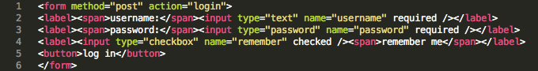
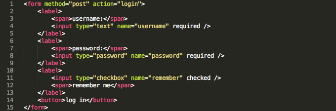
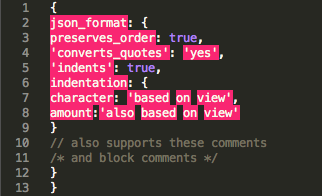
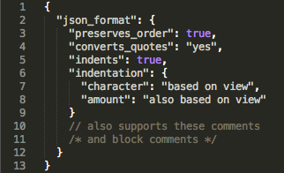
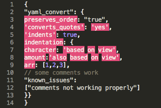
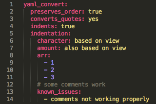

# IndentX

[](https://travis-ci.org/socsieng/IndentX) [](https://coveralls.io/r/socsieng/IndentX?branch=master)

IndentX is a forgiving indentation plugin for Sublime Text inspired by [Indent Xml](https://sublime.wbond.net/packages/Indent%20XML), aimed primarily at preserving attribute ordering and working with *invalid* content.

Supported content types:

* XML*-like* content
* JSON-*like* content

## Available Commands

* IndentX: Indent
* IndentX: Indent & format JSON
* IndentX: Convert JSON to YAML
* IndentX: Unindent
* IndentX: Report issue

Note: *IndentX: Convert JSON to YAML* should be considered *alpha*.

### IndentX: Indent

The *Indent* command will format both XML and JSON like content (content guess based on the first character `<` for XML) and can be accessed using the following keyboard short-cuts (think angle brackets: `control`/`command` + `k` + `<`):

* Windows: `control` + `k` + `,`
* Mac: `command` + `k` + `,`
* Linux: `control` + `k` + `,`

*XML before indenting:*



*XML after indenting:*



### IndentX: Indent & format JSON

The *Indent & format JSON* will try and indent and convert JavaScript-like objects to JSON (e.g. wrapping attributes in `"` and converting `'` strings to `"`). It can be accessed using the following keyboard short-cuts (think curly braces: `control`/`command` + `k` + `{`):

* Windows: `control` + `k` + `[`
* Mac: `command` + `k` + `[`
* Linux: `control` + `k` + `[`

*JSON before and after formatting:*




Note: If starting with a JavaScript object and you want to maintain the JavaScipt object format, use the [Indent](#Indenting) command instead.

### IndentX: Convert JSON to YAML

The *Convert JSON to YAML* command will try to convert a JSON document into YAML. As this feature is still very new, my personal experience with YAML is limited, this feature should be considered very *alpha*. Please [submit any issues](https://github.com/socsieng/IndentX/issues) you may have.

*JSON before and YAML after converting:*




### IndentX: Unindent

The *Unindent* command removes comments and whitespace to format content into one line.

### IndentX: Report issue

Launches a browser window with the recommended issue structure.

## How it works

IndentX uses regular expressions (probably more than it should) to identify tokens to:

* insert new lines
* increase indentation (begin tag/object)
* decrease indentation (end tag/object)

This technique has the following benefits:

* doesn't require valid strict XML or JSON (close enough should be good enough)
* preserves attribute order

## Installation

Install using Package Control.

## Issues

### Known issues

There is a known issue when upgrading from previous versions of IndentX where [sub modules aren't reloaded](https://github.com/socsieng/IndentX/issues/7). The work-around for this is to restart Sublime Text.

A solution to this issue should be available soon.

### Reporting issues

Please [report any issues](https://github.com/socsieng/IndentX/issues) with this plugin with the following sample structure in the body:

    Issue with command: {command name}

    Sample input:

    ```
    // provide sample here
    ```

    Expected result:

    ```
    // provide expected result here
    ```

Alternatively, the *IndentX: Report issue* command will launch a browser with this content pre-filled.
